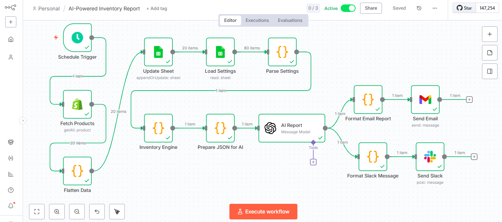
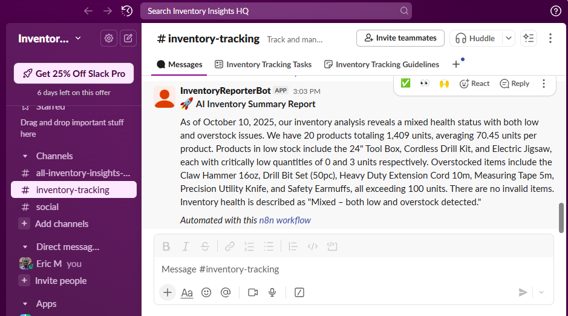
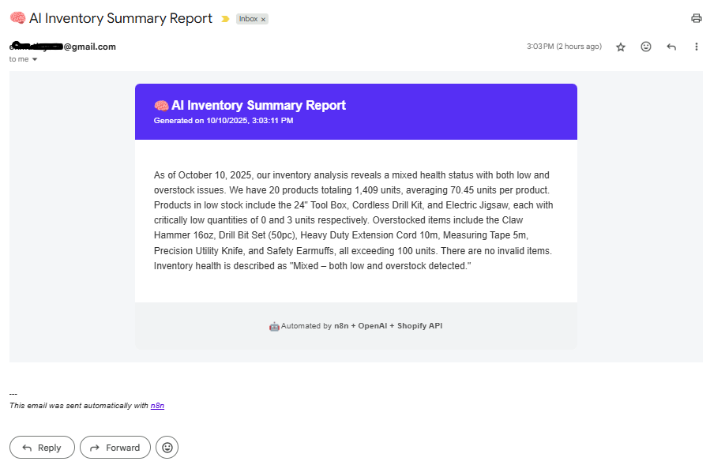

# 🧠 Shopify Inventory Automation with n8n & AI Integration

Automated workflow that fetches product data from Shopify, analyzes stock levels using AI, and sends smart inventory summaries to Slack and Email — all orchestrated through **n8n** and **Google Sheets**.

---

## 🚀 Overview

This automation integrates multiple tools to simplify e-commerce inventory monitoring.  
It intelligently reviews stock levels, identifies low and overstock items, and generates insightful AI reports — automatically sent to communication channels like **Slack** and **Gmail**.

---

## 🧩 Workflow Summary

### 🔄 1. Scheduled Trigger
The workflow begins automatically based on a schedule (daily or weekly).  
It ensures your inventory analysis runs consistently without manual intervention.

### 🛍️ 2. Shopify → Fetch Products
Retrieves all product and variant data directly from your **Shopify store** using the **Shopify Admin API** via an HTTP Request node.

### 🧮 3. Code → Flatten for Google Sheets
Cleans and flattens nested Shopify data structures into a spreadsheet-friendly format for better storage and reporting.

### 📊 4. Google Sheets → Update `Inventory_Data`
Writes or updates inventory details in the `Inventory_Data` sheet, keeping your product list always synchronized.

### ⚙️ 5. Google Sheets → Load Settings
Reads configuration parameters (e.g., alert mode, stock thresholds) from your `Settings` sheet for flexible customization.

### 🧠 6. Code → Parse Settings
Converts key-value rows into a structured JSON object:
{
  "mode": "category",
  "send_alerts": "yes",
  "include_invalid": "yes",
  "summary_limit": "10"
}

### 📈 7. Code → Inventory Intelligence Engine
Performs the core inventory evaluation using both sheet data and parsed settings:
Detects low stock, overstock, and invalid items
Computes average stock levels
Generates a structured summary object for AI analysis

### 🤖 8. Code → Prepare JSON for AI
Formats the summary into a standardized JSON prompt for OpenAI to interpret and summarize intelligently.

### 🧠 9. OpenAI → Generate Report
Generates a natural-language AI summary with context-aware insights, such as:
“As of today, inventory health is mixed. The Cordless Drill Kit is low in stock, while several other tools are overstocked.”

### 💬 10. Code → Format Slack Message
Creates a rich Slack-formatted report with emojis and bullet lists:

### 🚀 *AI Inventory Summary Report*
*Low Stock:*  
- 24" Tool Box 🚨  
- Cordless Drill Kit 🚨  

*Overstock:*  
- Claw Hammer 16oz ✅  
- Drill Bit Set (50pc) ✅  

*Inventory Health:* Mixed – low and overstock detected

### ✉️ 11. Code → Format Email HTML Report
Generates a clean HTML-based report for Gmail with highlighted sections and a timestamp.

### 📤 12. Slack → Send AI Report
Posts the final AI summary automatically to your chosen Slack channel via a connected bot.

### 📧 13. Gmail → Send Email Report
Emails the same AI summary to your preferred address using OAuth-secured Gmail integration.

---

## 🧱 Tech Stack
| Tool                  | Purpose                                     |
| --------------------- | ------------------------------------------- |
| **n8n**               | Automation and workflow orchestration       |
| **Shopify Admin API** | Source of product and stock data            |
| **Google Sheets API** | Dynamic data storage and configuration      |
| **OpenAI API**        | Natural language analysis and summarization |
| **Slack API**         | AI report delivery to teams                 |
| **Gmail API**         | Email delivery of AI-generated reports      |

---

## 🧩 Folder Structure
AI-Powered-Shopify-Inventory-Reporter/
├── README.md
├── workflows/
│   └── shopify_inventory_ai_report.json
├── assets/
│   ├── workflow_screenshot.PNG
│   ├── ai_report_slack_sample.PNG
│   └── ai_report_email_sample.PNG
└── docs/
    ├── setup_guide.md
    └── node_flow_explained.md

---

## 🧰 Prerequisites
- Docker installed and running
- n8n set up locally (http://localhost:5678)
- Shopify Admin API credentials (API key, password, store domain)
- Google Cloud project for Sheets and Gmail OAuth
- OpenAI API key
- Slack App & Bot (added to channel)

---

## ⚙️ Setup Guide
1. Clone this repository
git clone https://github.com/<your-username>/AI-Powered-Shopify-Inventory-Reporter.git
cd AI-Powered-Shopify-Inventory-Reporter
2. Import the workflow
	- Go to n8n → Workflows → Import from File
	- Upload: workflows/shopify_inventory_ai_report.json
3. Update credentials
	- Shopify, Google Sheets, OpenAI, Slack, and Gmail credentials
	- Test each connection from n8n
4. Set schedule trigger
	- Adjust timing for daily/weekly automation
5. Run workflow
	- Watch it fetch, analyze, summarize, and send reports 🚀

---

## 🖼️ Visual Overview
| Stage        | Example                                     |
| ------------ | ------------------------------------------- |
| n8n Workflow |  |
| Slack Report |  |
| Email Report |  |

---

## 🪄 Features
✅ Automated daily inventory analysis

🧠 AI-enhanced reporting with human-readable summaries

📊 Real-time data sync with Google Sheets

💬 Team notifications via Slack

📧 Email reports for management visibility

🔒 Secure OAuth connections for all integrations

---

## 🌱 Future Enhancements
- WhatsApp notification integration
- Real-time Shopify Webhook triggers
- Category-based predictive restocking recommendations
- Custom analytics dashboard for product trends

---

## 📜 License
This project is licensed under the MIT License — see the LICENSE file for details.

---

## 👤 Author
**Eric M.**  
Full-Stack Developer | E-commerce & Automation | Python, Shopify, APIs Freelancer  
[View My GitHub Projects](https://github.com/Ek-Coder-Tech)

---

## 📬 Contact
For freelance inquiries, please reach out via [Upwork Profile](https://www.upwork.com/freelancers/~012558bab6232e8e65)